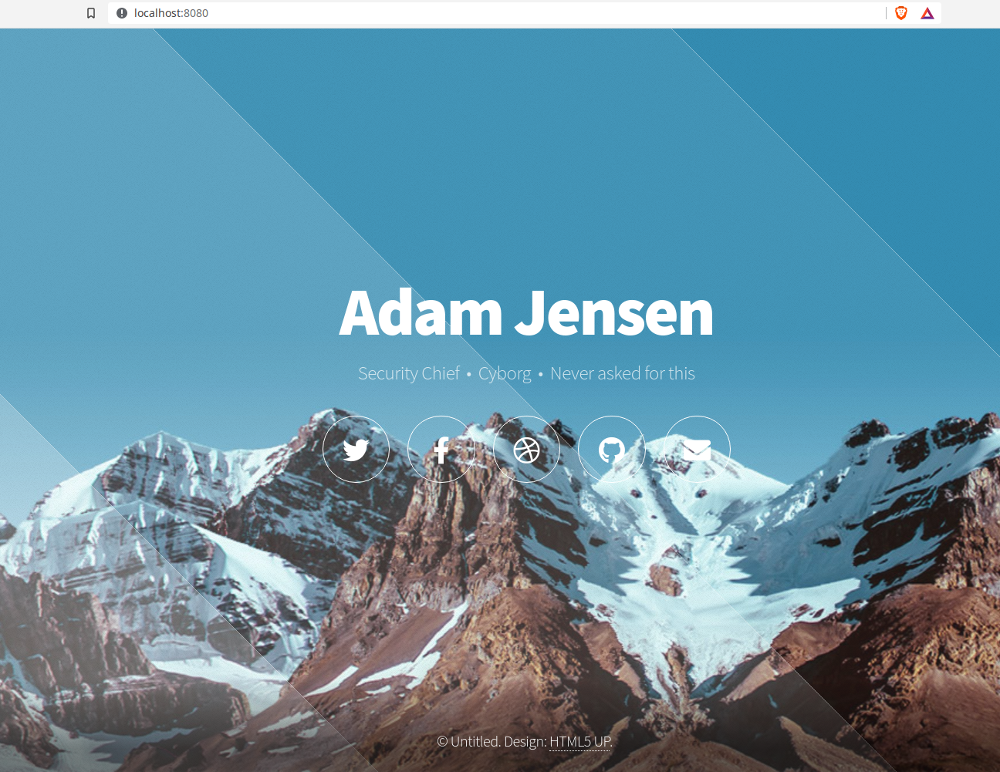
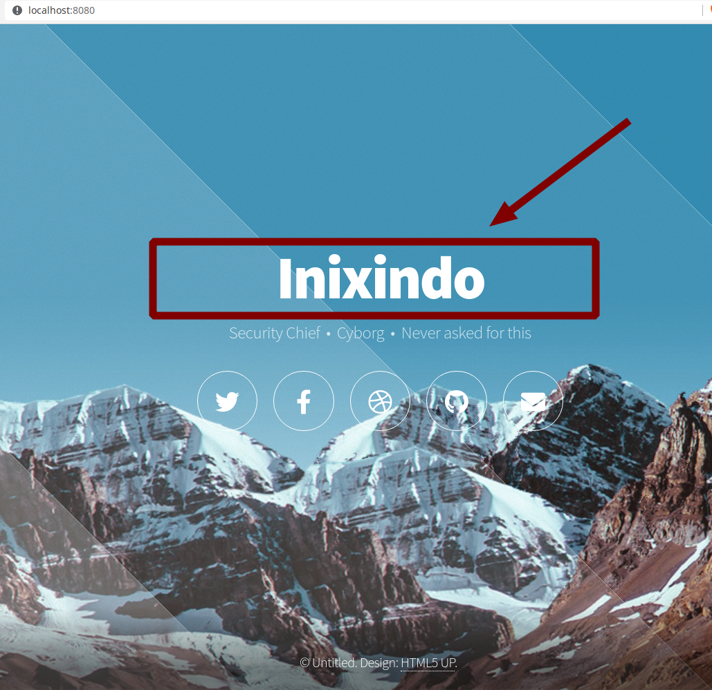

# Lab: Membangun Website dengan Docker Volume

---

## Tujuan Instruktional Khusus

Setelah menyelesaikan lab ini, Peserta akan dapat menggunakan volume pada docker container untuk dapat menyimpan data secara permanen, yang tidak hilang walaupun docker container dihapus (*remove*).

---

## Prosedur Pelaksanaan:

----

### Membuat Volume

```bash
$ docker volume create data_volume
data_volume
```

- Jika nama volume tidak disertakan Docker akan membuat volume dengan nama yang acak

```bash
$ docker volume create
2643a454f5bfb9592c2358ff624bc986b32a85848f80e42ee781d21c008b2f7a
```

----

### Menampilkan daftar Volume

- subperintah ls digunakan untuk menampilkan daftar volume

```bash
$ docker volume ls
DRIVER    VOLUME NAME
local     data_volume
local     2643a454f5bfb95...
```

----

### Menginspeksi Volume

- Untuk menampilkan detil informasi mengenai volume, dapat menggunakan subperintah inspect:

```bash
$ docker volume inspect data_volume
[
    {
        "CreatedAt": "2021-06-14T12:29:45+07:00",
        "Driver": "local",
        "Labels": {},
        "Mountpoint": "/var/lib/docker/volumes/data_volume/_data",
        "Name": "data_volume",
        "Options": {},
        "Scope": "local"
    }
] 
```

----

### Menghapus *Volume*

```bash
$ docker volume rm data_volume
data_volume
```

----

### Memangkas *Volume*

- Untuk menghapus semua volume yang tidak digunakan (tidak dimount oleh container), dapat dihapus dengan perintah prune.

```bash
$ docker volume prune
WARNING! This will remove all local volumes not used by at least one container.
Are you sure you want to continue? [y/N] 
```

---

## Lab:  Membangun WebSite dengan Docker Volume

----

### Prosedur 1: Membuat WebSite pada Volume

> :dart:Obyektif
> - Membuat docker Volume
> - Menempatkan WebSite kedalam Volume

----

#### Membuat docker volume

```bash
$ docker volume create web_volume
$ docker volume list
```

----

#### Ekstrak Mountpoint pada docker Volume

```bash
$ docker volume inspect web_volume
$ docker volume inspect web_volume --format '{{ .Mountpoint }}'
$ MP=$(docker volume inspect web_volume --format '{{ .Mountpoint }}')
$ echo $MP
```

> :writing_hand: Catatan:
>
> - Ekstrak Mountpoint dan menyimpannya ke dalam variable (MP), nantinya memudahkan untuk meletakkan website ke dalam volume

----

#### Unduh html5 site template

```bash
$ take ~/labs/
$ wget --no-check-certificate https://html5up.net/aerial/download \
	-O temp.zip
```

----

#### Unzip dan letakkan pada docker volume

```bash
$ echo $MP
$ sudo unzip temp.zip -d $MP
$ rm temp.zip
$ ls $MP
```

---


### Prosedur 2: Membangun Docker Image http-server

> :dart: Obyektif
> - Menggunakan node-alpine sebagai dasar untuk pembuatan image
> - Memasang http-server
> - Membangun docker image dari Dockerfile

----

#### Lihat daftar docker images

```bash
$ docker images | grep -i http-server
$ ls Dockerfile
```

> :writing_hand: Catatan
>
> - Perintah diatas tidak menunjukkan hasil apapun, yang berarti belum ada image dan berkas yang sudah dibuat

----

#### Membuat berkas Dockerfile

```bash
$ cat <<EOF > Dockerfile
FROM node:alpine
WORKDIR /public
RUN npm i -g http-server \
	&& npm cache clean --force
EXPOSE 8080
CMD ["http-server"]
EOF
```

----

> :writing_hand: Catatan:
> - FROM: base image
> - WORKDIR: direktori kerja untuk berkas html
> - RUN: jalankan install http-server dan hapus cache yang tidak diperlukan untuk memperkecil ukuran image
> - EXPOSE: buka port 8080, sehingga bisa diakses diluar container
> - CMD: jalankan http-server
> - cat <<EOF: fasilitas bash "here document", yang akan menyimpan naskah antara <<EOF dengan EOF, kedalam berkas Dockerfile, melalui *redirect output* (>Dockerfile)

----

#### Periksa kembali berkas Dockerfile yang telah dibuat

```bash
$ ls Dockerfile
$ more Dockerfile
```

> :bulb:Petunjuk:
>
> - Periksa kembali apakah ada kesalahan penulisan (typo error)

----

#### Membangun docker Image dengan Dockerfile

```bash
$ docker images| grep http-server
$ docker build -t http-server .
$ docker images | grep http-server
```

> :writing_hand:Catatan:
>
> - perhatikan ada tanda dot (.) diakhir perintah docker build

---

### Prosedur 3: Mengaktifkan Website

> :dart:Obyektif
>
> - Mengaktikan container website dari docker image
> - Mengakses container website menggunakan browser

### Aktifkan Website dengan menjalankan Container myhttp

```bash
$ docker run \
	--rm \
	--name myhttp \
	-p 8080:8080 \
	-v web_volume:/public \
	-d http-server
```

----

> :writing_hand:Catatan:
> --rm: remove, Akan otomatis menghapus container stelah container dihentikan (*stop*)
> --name: name, memudahkan akses ke container menggunakan nama
> -p: publish, Mem-*publish*, *port* yang di *EXPOSE*
> -v: volume, Menyantumkan (*mount*) *Volume* yang berada pada sub lokal direktori aktif "**$(pwd)/web**" ke direktori yang ada pada container  "**/public**".
> -d: detach, melepas proses container ke background

----

#### Akses website menggunakan Browser



---

## :construction_worker_man:Tugas: Ubah Title pada website

----

#### Ubah Title

```bash
$ sudo sed -i 's/Adam Jensen/Inixindo/g' $MP/index.html
$ more ./web/index.html
```

> Catatan:
>
> - Untuk mengedit berkas melalui GUI, dapat menggunakan "**leafpad**"", atau tanyakan pada fasilitator

----

#### Lihat perubahan website melalui browser



----

> :writing_hand:Catatan:
>
> - Untuk merefresh halaman, dapat menggunakan tombol <ctrl-r> atau F5 atau tekan tombol refresh pada webbrowser.

---

##  :construction_worker_man: Pengujian: Membuat ulang Container

----

### Menghentikan Container

```bash
$ docker stop myhttp
$ docker ps -a
```

> :writing_hand:Catatan:
>
> - Setelah container di hentikan (stop), docker akan otomatis menghapus (remove) container, karena container tersebut dijalankan dengan menggunakan opsi --rm

----

#### Jalankan kembali http-server container

```bash
$ docker run 
	--rm
	--name myhttp \
	-p 8080:8080 \
	-v web_volume:/public
	-d http-server
```

----

> :bulb:Petunjuk:
>
> - untuk mempercepat penulisan ulang perintah, gunakan <ctrl-r> dan ketikkan teks yang ada dalam perintah yang akan diulang: misal "http-server"
> - gunakan tombol panah atas, bawah untuk memilih perintah yang sesuai
> - tekan <enter> untuk memilih perintah yang diinginkan

----

### Lihat kembali pada Browser

- Apakah Title tetap kembali seperti yang terakhir perubahan (Inixindo)?

> :writing_hand:Petunjuk:
>
> - Walaupun Container di buat ulang (recreate), website tidak berubah kembali ke awal, karena container menggunakan volume persistent storage.

---

## Tantangan: Membangun Image Website tanpa Volume

----

### Membangun Website

> :bulb:Petunjuk::
> - Buat Image dengan nama tag  "**website**"
> - Download template website (https://html5up.net/parallelism/download) atau buat website sendiri
> - Extrak zip file dan letakkan lokal website ke image direktori /public (gunakan perintah "COPY . ." pada Dockerfile)
> - Jalankan image **website** dengan nama container mywebsite
>- lihat dengan browser website yang telah dibuat

### Mengubah Website

> :bulb:Petunjuk::
> - Ubah title pada lokal website (index.html)
> - Salin kembali lokal website ke container mywebsite (bukan ke image!)
```bash
$ docker cp index.html mywebsite:/public
```
> - Lihat dengan browser, apakah website telah berubah?

### Membuat ulang container website

> :bulb:Petunjuk::
> - Stop container mywebsite (otomatis akan menghapus container)
> - Jalankan kembali image **website** dengan nama container mywebsite
> - Lihat website dengan browser
> - Apakah tampilan title seperti pada tampilan yang terakhir (setelah diubah)? Jelaskan.

---

# Terima kasih
